These are my solutions to the [2023 Advent of Code](https://adventofcode.com/2023) puzzles. I'm attempting to solve them as they come out, along with a small group of friends. I'll also be writing my impressions of each puzzle.

# Puzzle 1

Day 1 penance sketch: deferred.

Part 1 was not too bad. I found my code golf instincts kicking in, which is why my solution is structured the way it is. Part 2 was unexpectedly evil. It tripped up a lot of my friends. I found myself getting sucked into a trap where I thought I had failed to solve the problem, but actually I had made a typo when entering my solution. Whoops!

# Puzzle 2

Day 2 penance sketch: deferred.

This one was harder to understand than to solve. Part 1 was straightforward. On Part 2 I was tripped up by my dyslexia (did a min instead of a max), but otherwise it was straightforward too. When I saw the flavor text about "bags with colored cubes" I recognized the phrasing from some much harder mathematical problems, and thought I was in for something much harder.

(Historical note: I've done a dozen or two puzzles before now, but always a la carte. I've never actually sat there waiting for the timer to count down until this time.)

# Puzzle 3

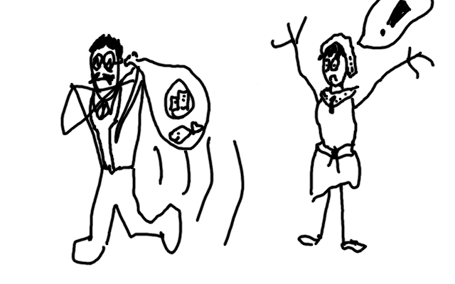

Day 3 penance sketch: "Did Veris just lose?!"

I actually placed sort of high on the leaderboard this time. Probably because this puzzle is unusual compared to other AOC puzzles, and so folks with extensive libraries of AOC-tailored code are at a disadvantage. My result was also not entirely unmaintainable, although it is really not structured well for testing, and... ugh, that O(n²) bit, I am not proud of.

# Puzzle 4

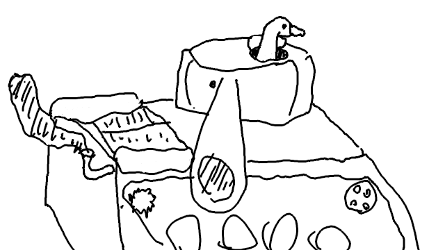

Day 4 penance sketch: "Goose Tank"

Uneventful. I'm not thrilled about needing a mut for part 2.

# Puzzle 5

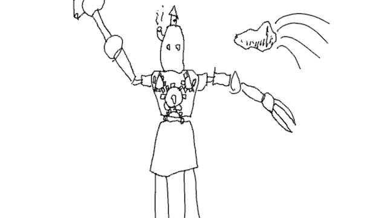

Day 5 penance sketch: "Steampunk Rock Paper Scissors"

This one was very very dense. I first implemented it without much optimization, but my spidey sense tingled and when I saw part two I saw that it was right to tingle. I ended up implementing a brute force solution first. I knew how to solve it properly, but I had to prove to my audience that rust is *fast*. So, with the aid of Rayon, some sorting, and the humble binary search, I got it chewing through all 2 132 355 834 possible seeds in just 11.843 seconds. (Then I implemented it properly, and that solution takes so little time to run that I can't measure it on my Ryzen.)

# Puzzle 6

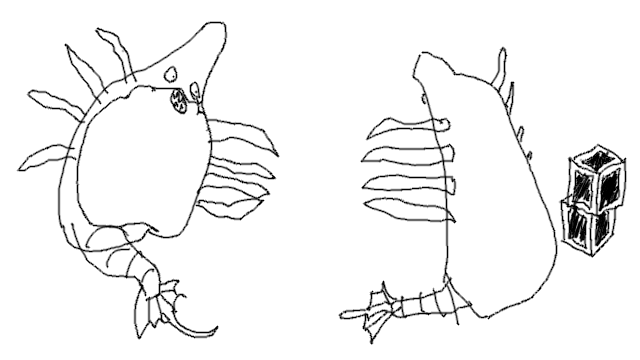

Day 6 penance sketch: "Draygons!"

This one was confusing. I was really afraid of how small the puzzle was. I expected part 2 to be a doozy. I was not afraid for the right reasons. It ended up being confusingly fast and easy to solve. I got tripped up by ilog10, and... that was all.

?????????

I expected to have to do math...

# Puzzle 7

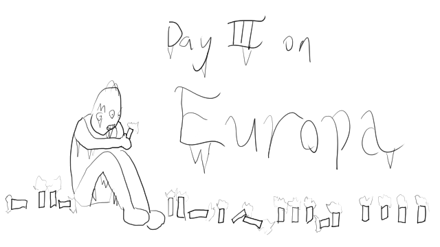

Day 7 penance sketch: "There are too many torches."

I've actually done some poker simulation work in the past, so I was primed for this puzzle. This ended up working against me, though, since I sorted the cards in the hand (e.g. "2KKAK" → "AKKK2"), which Camel Cards does not do.

The changes in part 2 were disruptive enough that, instead of trying to make one codebase that could solve both problems, I made another bin for part 2.

# Puzzle 8

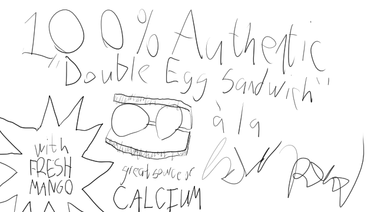

Day 8 penance sketch: "Egg sandwiches. Plurals optional."

Kinda confused by this whole puzzle. The nature, not the puzzle itself. Not too difficult to write, though it was pretty scary until I realized that the initial and subsequent cycles were always the same in these inputs. (I was afraid I was going to have to break a cryptosystem today...)

# Puzzle 9

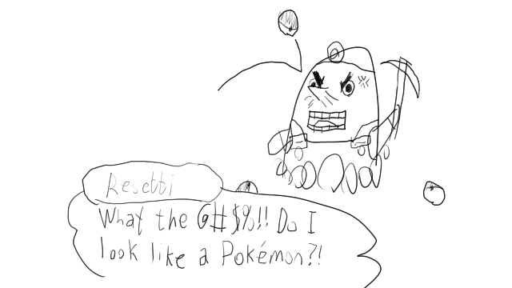

Day 9 penance sketch: "Someone tried to catch Mr. Resetti with a pokéball."

I was really excited by this puzzle. I don't know why, but its structure was very fun. My solution to part 2 was brute force but effective. There's a logic SNAFU in my solution that really bothers me, but I'm not able to figure out what it is...

# Puzzle 10

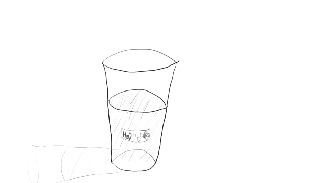

Day 10 penance sketch: "Non-Newtonian fluids."

I was excited by this puzzle, too. Kind of a one-dimensional Dijkstra problem. I was briefly scared of part 2, until I realized that it was equivalent to the polygon filling problem.

I spent some extra time making a general `Tilemap` struct for part 1, and I'm glad I did.

# Puzzle 11

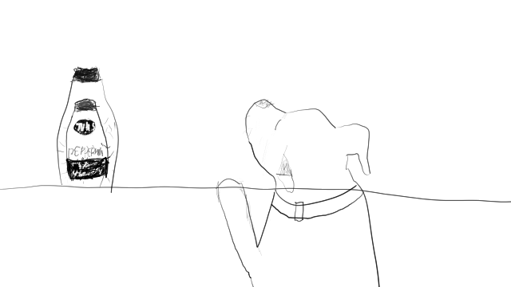

Day 11 penance sketch: "Izsha doesn't have t[h]um[b]s."

I immediately benefitted from having `Tilemap` as a utility to use. I gave it a few extra features and the naive solution was easy. But even in Rust and even with `--release`, brute forcing part 2 wasn't possible. So I had to do it properly...

# Puzzle 12

Day 12 penance sketch: deferred.

A nasty bruteforce solution replaced by an Inspector General reference that is still pretty brute force. It took hours and hours and hours to run. I'm not happy with it or about it. I came up with a new approach far too late in the night, didn't implement it because once I got the second star all puzzle solving juice evaporated from my brain.

# Puzzle 13

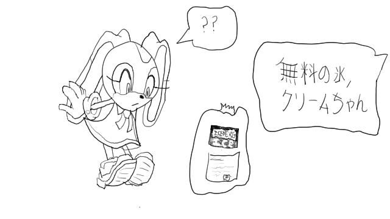

Day 13 penance sketch: "Free ice cream."

This puzzle wasn't too bad. I thought I'd found a bug in the puzzle input, but I had just had two off-by-ones cancel each other out in my own code. Part 2 was confusing and I got a little bitter, but I soon was set right.

I implemented transpose back when I turned `Tilemap` into a library. It paid off.

# Puzzle 14

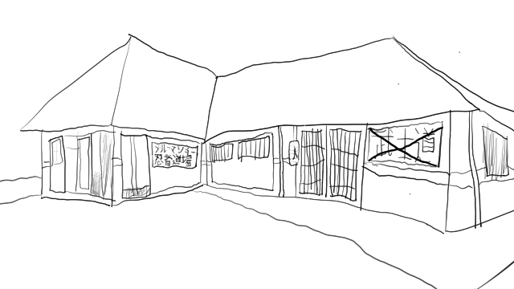

Day 14 penance sketch: "This is not a place of honor."

`Tilemap` strikes again! Part 1 not too difficult. Part 2 significantly eased by vague memories of how [Hashlife](https://en.wikipedia.org/wiki/Hashlife) works.

# Puzzle 15

Day 15 penance sketch: deferred.

Uneventful.

# Puzzle 16

Day 16 penance sketch: deferred.

This is an Oxyd puzzle! I love Oxyd! VROOOOOOM!

# Puzzle 17

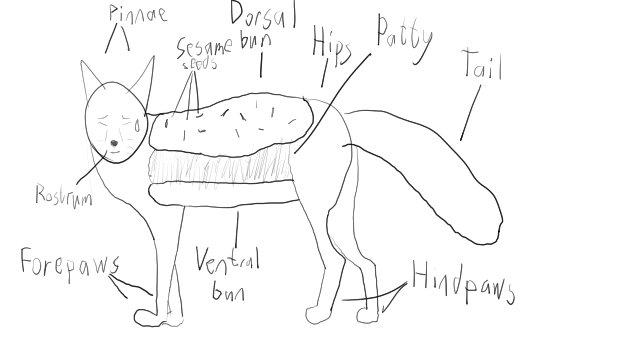

Day 17 penance sketch: "Fox burger."

I thought I could use Dijkstra to solve this problem but apparently not. Part 2 was relatively easy after part 1.

# Puzzle 18

Day 18 penance sketch: deferred.

I went in all cocky like "aw man I made a Bentley-Ottmann crate, I can use it!" but it didn't turn out to be that applicable. My part 1 solution wasn't quite brute force, but it was blunt force. Part 2 made me tear my hair out. I actually implemented the correct solution after "only" about an hour and a half, except that I made a mistake that caused me to count *every row as filled* at the last moment, so I went around in circles reimplementing stuff until, on my third try, I didn't make that mistake. Argh! I'm not at all happy with this solution but I got the stars, and I gotta save some juice for tomorrow!

# Puzzle 19

Day 19 penance sketch: deferred.

Part 1 was easy. Part 2 was *exciting*. I wasted a lot of time doing extra work to manage *groups of ranges*, forgetting that `<` and `>` cannot result in more than one range on either side. And then a lot of time trying to get VS Code's debugger to redirect stdin, a feature that *doesn't work*. But I did it.

# Puzzle 20

Day 20 penance sketch: deferred.

Part 1 was uneventful. I confidently jumped into part 2 with a brute force solution, then realized the problem. After a few hours of screwing around, I made an ER diagram of the inputs and noted the structure of the puzzle. After that, the solution was pretty simple.

# Puzzle 21

Day 21 penance sketch: deferred.

I wasn't *sure* this could be modelled as a cellular automaton, so I used a Dijkstra-flavored algorithm to solve part 1. Observing the results (and, in hindsight, basic 2D math) showed me that I could. I went down several rabbit holes with part 2, including trying to export the problem into Golly (which couldn't handle the scale). I have not yet gotten the gold star for part 2. I don't know where the holes in my math are, so I'm going to sleep on it.

(Tiny typoes to the rescue! Still technically got it within 24 hours.)

# Puzzle 22

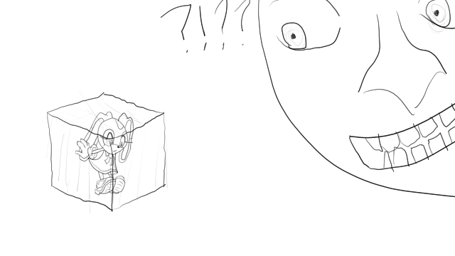

Day 22 penance sketch: "Bribing moon with ice cream."

Aside from the _Yoshi's Island_ flashbacks, this one was easy. Annoyingly easy. I don't know why but I took it personally that it was so easy. It was much harder to explain my solution than to write it. I didn't end up having to write a proper brick intersection function because the naive O(n²) method was fast enough. :Z

# Puzzle 23

Day 23 penance sketch: deferred.

An Oxyd puzzle again!

While I was pondering a better, graph-theory-driven solution for part 2, my brute force solution gave me an answer. I helped a student implement the better solution though.

(I ended up on the global leaderboard for once! I'm gonna feel pretty self-important for a while.)

# Puzzle 24

Day 24 penance sketch: nope.

Part 1 was easy and a little fun. It gave me a bad feeling because it "required" floating point math (unlike literally every other AOC puzzle I've ever seen), but it was math I knew and could teach, so I was okay with it.

Part 2 was infuriating.

I'm seriously, genuinely upset about this. I feel like I got to the million dollar question and then found out the hard way that the game was fixed against me all along. Every other AOC puzzle I've ever solved was made of things that a programmer should know, or could benefit from learning. Every other puzzle was wonderfully fertile ground for teaching (and learning from!) my students. Part 2 of puzzle 24 this year is completely out of left field in "physics PhD" territory. I pledged to solve every puzzle this year and I was bait and switched out of keeping that pledge at the last second.

I'm leaving the source code of the point at which I gave up on my solution in here. It solves part 1. I tried to put together various root solvers to solve part 2 but it wasn't good enough. I tried to understand the math well enough to solve it myself but I got nothing but a headache from that. Meanwhile, over a thousand people have "solved the puzzle" by shoving a system of equations into MATLAB or Z3 by hand, and they all got their gold stars.

Well, if that's the standard, I'm getting mine and moving the fuck on.

[Edit after the fact]

Here's a better metaphor. I'm on day 24 of a 25-day painting contest. I'm partly here because I watched the previous years and loved watching all the painters get better by painting with different materials, methods, subjects, etc. Going outside their comfort zones and honing their craft. So imagine my surprise when I find out that day 24's painting challenge is "3D print a Benchy using the provided filament".

If I encounter a complex system of linear equations "in the wild", I'll break out Octave or pull up Wolfram Alpha and I'll solve it that way. Just like how if I need a Benchy I'd use a 3D printer and not a paintbrush. But this was a *painting* contest, not a *usually painting but occasionally other barely-related things* contest!

I'm really unreasonably upset about this.

# Puzzle 25

Day 25 penance sketch: deferred.

A nice exercise. Brute force, plus a little help from hand tracing of an ERD. Slam.
